# VM Resource Matrix

> **Enterprise Reference Architecture — FOSS Home Lab**

> [!IMPORTANT]
> **Public Documentation Notice**
>
> All domain names, IP addresses, hostnames, infrastructure identifiers and resource allocations shown in this repository are **documentation-only examples**.
>
> They do not represent the actual production or laboratory environment.
>
> **Documentation Domain:** `corp.example.com`

---

## 1. Physical Host

The reference architecture is designed to simulate an enterprise IT environment on a single physical host running **Proxmox VE**.

| Resource        | Specification                  |
| --------------- | ------------------------------ |
| Physical Host   | Dell Latitude 5540             |
| CPU             | 13th Gen Intel® Core™ i7-1355U |
| Physical Cores  | 10                             |
| Logical Threads | 12                             |
| Memory          | 32 GB DDR4-3200                |
| Storage         | 512 GB PCIe NVMe Gen4 x4       |
| Hypervisor      | Proxmox VE                     |
| Architecture    | x86-64 / AMD64                 |

### Physical Resource Model

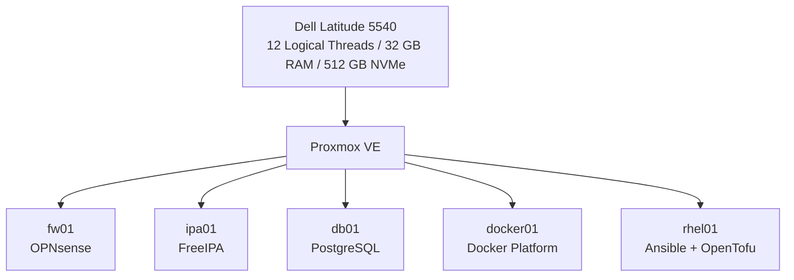

---

# 2. Public Naming Convention

The real laboratory environment is intentionally separated from the public reference architecture.

### Public Documentation

```text
corp.example.com
```

Example FQDNs:

```text
pve.corp.example.com
fw01.corp.example.com
ipa01.corp.example.com
db01.corp.example.com
docker01.corp.example.com
rhel01.corp.example.com
```

### Public Example Network

```text
10.10.0.0/16
```

| VLAN | Network         | Purpose         |
| ---: | --------------- | --------------- |
|   10 | `10.10.10.0/24` | Management      |
|   20 | `10.10.20.0/24` | Identity / Core |
|   30 | `10.10.30.0/24` | Database        |
|   40 | `10.10.40.0/24` | Application     |

Gateway convention:

```text
10.10.<VLAN>.1
```

---

# 3. VM Architecture

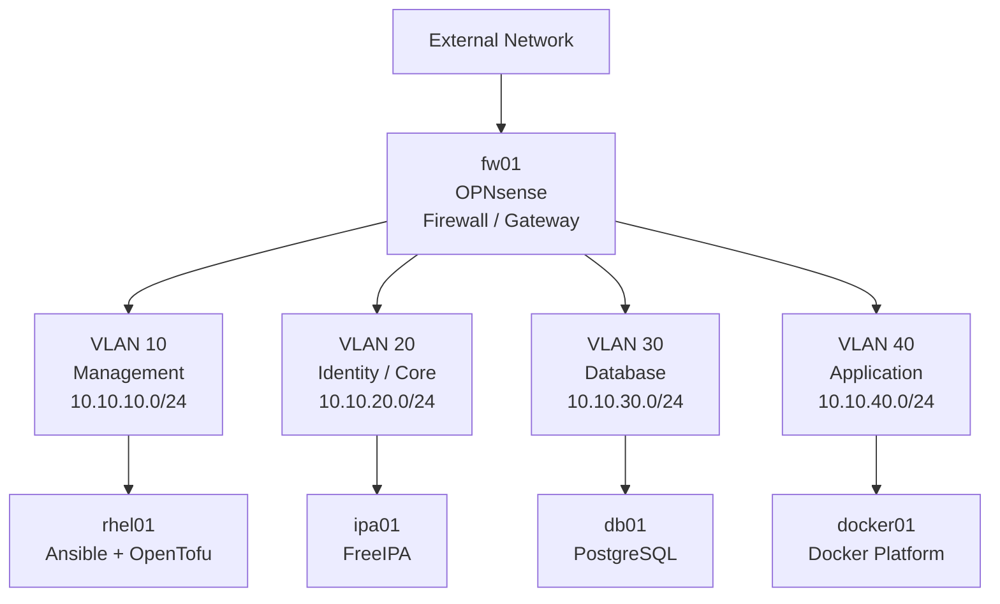

---

# 4. VM Resource Matrix

|     VM ID | Hostname   | Role               | Operating System | VLAN | Example IP    |   vCPU |       RAM |    OS Disk |  Data Disk | Total Disk |
| --------: | ---------- | ------------------ | ---------------- | ---: | ------------- | -----: | --------: | ---------: | ---------: | ---------: |
|       100 | `fw01`     | Firewall / Gateway | OPNsense         |    — | `10.10.x.1`   |      2 |  **4 GB** |      40 GB |          — |      40 GB |
|       101 | `ipa01`    | Identity / DNS     | Fedora Server    |   20 | `10.10.20.10` |      2 |      2 GB |      16 GB |      16 GB |      32 GB |
|       102 | `db01`     | Central PostgreSQL | Pardus Server    |   30 | `10.10.30.10` |      4 |      8 GB |      32 GB |      96 GB |     128 GB |
|       103 | `docker01` | Container Platform | Ubuntu Server    |   40 | `10.10.40.10` |      4 |     10 GB |      32 GB |     128 GB |     160 GB |
|       104 | `rhel01`   | Automation         | RHEL             |   10 | `10.10.10.10` |      2 |      4 GB |      20 GB |      20 GB |      40 GB |
| **TOTAL** |            |                    |                  |      |               | **14** | **28 GB** | **140 GB** | **260 GB** | **400 GB** |

---

# 5. CPU Allocation

The physical CPU provides:

```text
12 logical threads
```

The initial VM allocation is:

```text
fw01       2 vCPU
ipa01      2 vCPU
db01       4 vCPU
docker01   4 vCPU
rhel01     2 vCPU
-----------------
TOTAL     14 vCPU
```

This results in a controlled CPU overcommit ratio:

```text
14 vCPU / 12 logical threads
≈ 1.17 : 1
```

### CPU Allocation

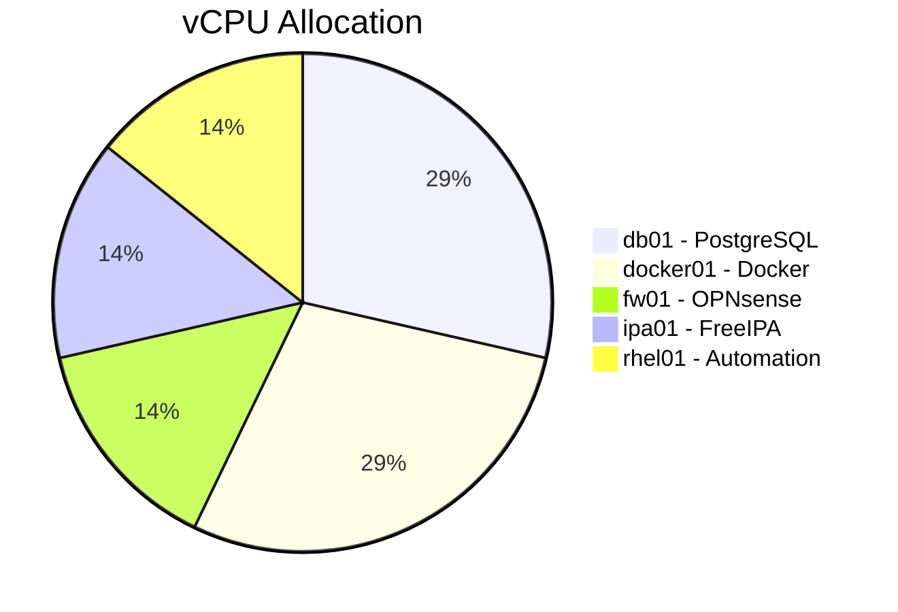

> [!NOTE]
> CPU overcommit is intentional but conservative. The architecture avoids aggressive overcommit because PostgreSQL and the Docker application platform may experience concurrent workloads.

---

# 6. Memory Allocation

Physical memory:

```text
32 GB
```

VM allocation:

```text
fw01       4 GB
ipa01      2 GB
db01       8 GB
docker01  10 GB
rhel01     4 GB
-----------------
TOTAL     28 GB
```

Remaining:

```text
32 GB - 28 GB = 4 GB
```

### RAM Allocation

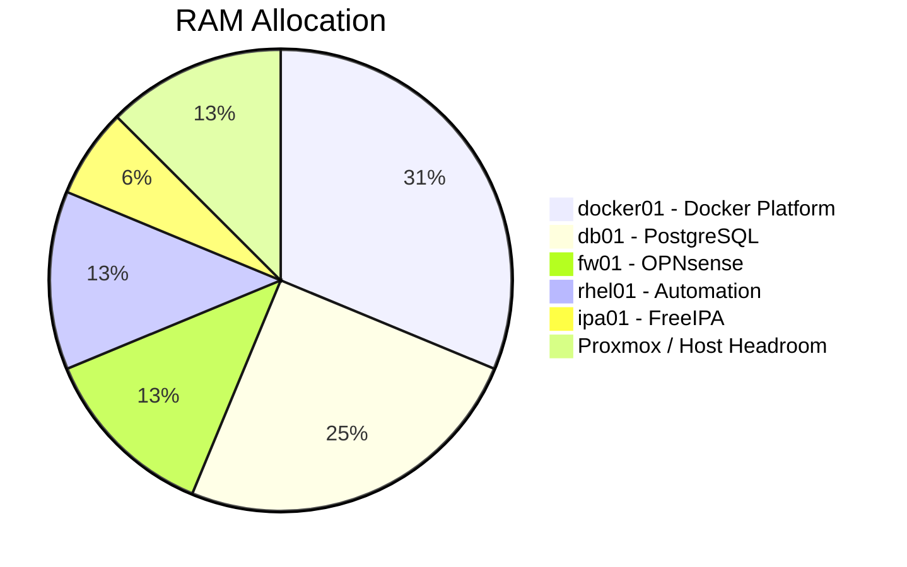

The remaining 4 GB is deliberately reserved for:

* Proxmox VE
* filesystem cache
* hypervisor overhead
* temporary workload spikes
* future adjustments

---

# 7. Storage Allocation

The physical host contains:

```text
512 GB NVMe
```

The VM allocation is:

```text
400 GB
```

leaving approximately:

```text
112 GB
```

for Proxmox storage overhead, future expansion and additional infrastructure requirements.

### Storage Allocation

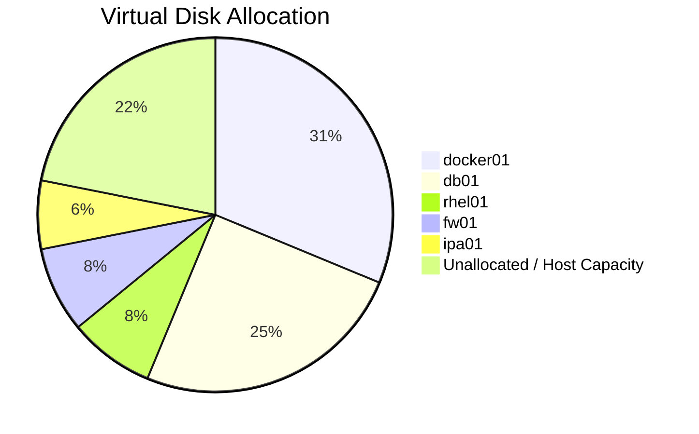

> [!NOTE]
> Actual usable capacity depends on Proxmox storage configuration, filesystem overhead and thin/thick provisioning.

---

# 8. Linux VM Disk Standard

Linux VMs use two virtual disks.

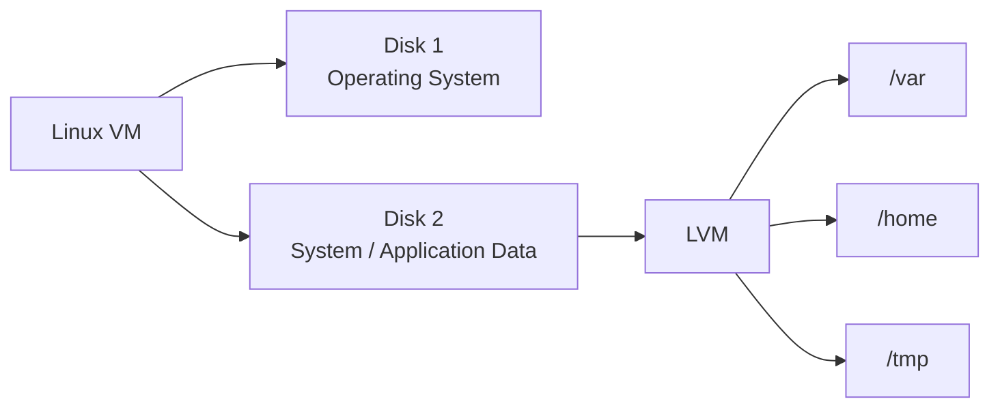

### Disk Standard

```text
Disk 1
└── /

Disk 2
└── LVM
    ├── /var
    ├── /home
    └── /tmp
```

The purpose is to isolate operating-system resources from system and application data.

Examples:

```text
/var/lib/postgresql
/var/lib/docker
/var/log
```

remain on the second virtual disk through the `/var` filesystem.

---

# 9. OPNsense Exception

OPNsense is not forced into the Linux VM disk model.

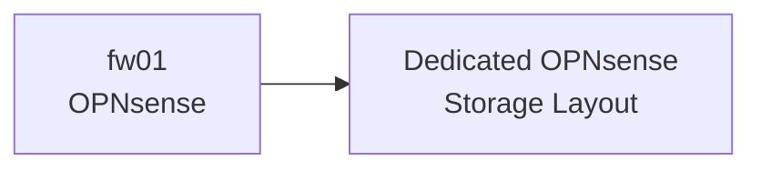

The Linux-specific:

```text
/
/var
/home
/tmp
```

separation is therefore **not applicable to OPNsense**.

### OPNsense Resource Decision

| Resource | Official / Reference | Lab Allocation |
| -------- | -------------------: | -------------: |
| CPU      |    Dual-core minimum |         2 vCPU |
| RAM      |         3 GB minimum |       **4 GB** |
| Storage  |         4 GB minimum |      **40 GB** |

OPNsense documents 3 GB RAM as the minimum, 4 GB as a reasonable configuration and 8 GB as the recommended level. The increased allocation is particularly relevant because this architecture includes additional services such as Squid.

---

# 10. ipa01 — FreeIPA

### Purpose

Central identity and infrastructure services:

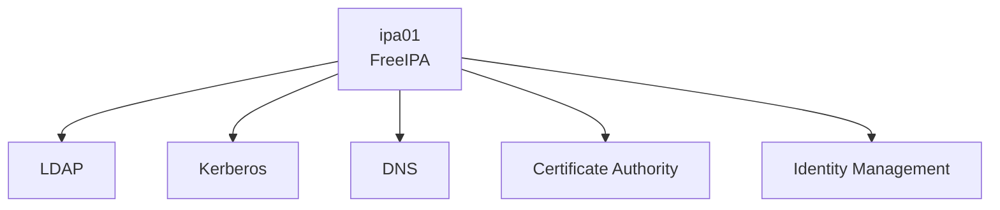

| Resource   |               Allocation |
| ---------- | -----------------------: |
| vCPU       |                        2 |
| RAM        |                     2 GB |
| OS Disk    |                    16 GB |
| Data Disk  |                    16 GB |
| VLAN       |                       20 |
| Example IP |            `10.10.20.10` |
| FQDN       | `ipa01.corp.example.com` |
| Realm      |       `CORP.EXAMPLE.COM` |

FreeIPA's documentation identifies 1.2 GB RAM as the minimum for installation with a CA and recommends 2 GB for a demo/test environment.

---

# 11. db01 — Central PostgreSQL

### Purpose

Central relational database platform for applications that officially support PostgreSQL.

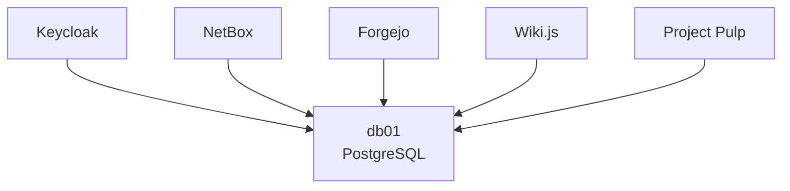

| Resource   |              Allocation |
| ---------- | ----------------------: |
| vCPU       |                       4 |
| RAM        |                    8 GB |
| OS Disk    |                   32 GB |
| Data Disk  |                   96 GB |
| VLAN       |                      30 |
| Example IP |           `10.10.30.10` |
| FQDN       | `db01.corp.example.com` |

### Database Naming Standard

```text
Application
    │
    ├── Database
    │      └── <application>_db
    │
    └── Database User
           └── <application>_dba
```

Examples:

```text
keycloak_db
keycloak_dba

netbox_db
netbox_dba

forgejo_db
forgejo_dba
```

Each application receives its own database and least-privileged database identity.

> [!IMPORTANT]
> Applications are **not forced to PostgreSQL** when their official architecture requires another datastore. Specialized storage systems remain application-specific.

---

# 12. docker01 — Container Platform

### Purpose

Central application platform for FOSS enterprise services.

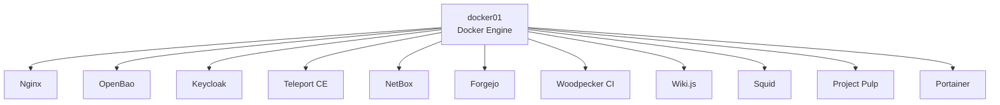

| Resource   |                  Allocation |
| ---------- | --------------------------: |
| vCPU       |                           4 |
| RAM        |                       10 GB |
| OS Disk    |                       32 GB |
| Data Disk  |                      128 GB |
| VLAN       |                          40 |
| Example IP |               `10.10.40.10` |
| FQDN       | `docker01.corp.example.com` |

The 10 GB RAM allocation is **not a Docker minimum**. It is a workload allocation for the collection of services planned for this VM.

### Data Disk

The data disk is primarily used for:

```text
/var
├── /var/lib/docker
├── container volumes
├── application data
└── logs
```

Application-specific storage requirements will be defined in the Docker Storage Matrix.

---

# 13. rhel01 — Automation

### Purpose

Central Infrastructure-as-Code and configuration-management node.

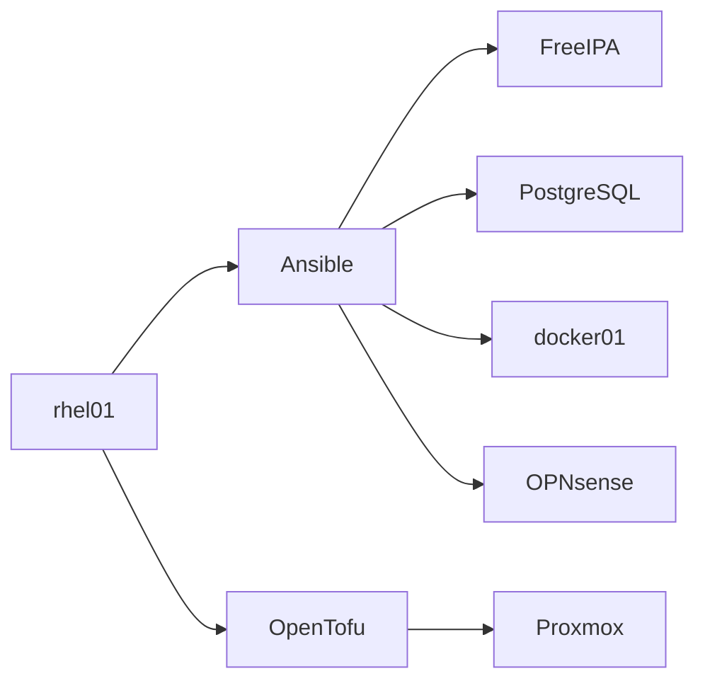

| Resource   |                Allocation |
| ---------- | ------------------------: |
| vCPU       |                         2 |
| RAM        |                      4 GB |
| OS Disk    |                     20 GB |
| Data Disk  |                     20 GB |
| VLAN       |                        10 |
| Example IP |             `10.10.10.10` |
| FQDN       | `rhel01.corp.example.com` |

The VM provides sufficient room for:

* RHEL
* Ansible
* OpenTofu
* Git repositories
* Python environments
* automation artifacts
* temporary provisioning data

---

# 14. Dependency Overview

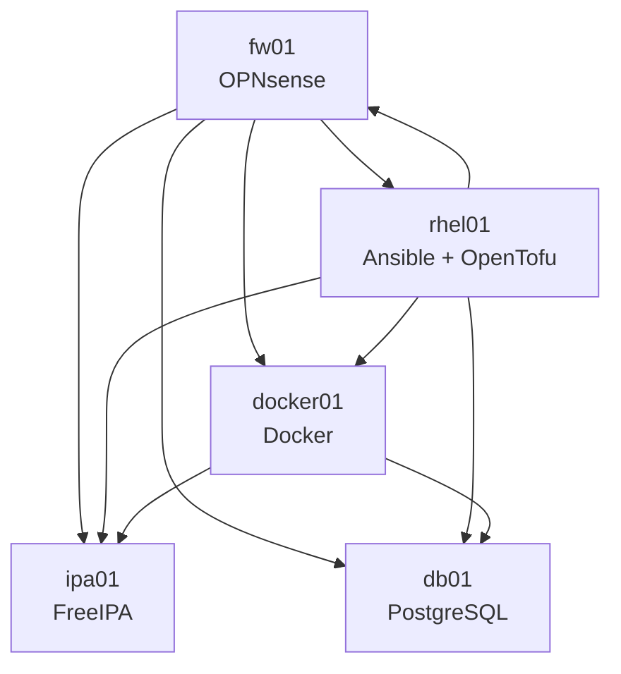

The dependency hierarchy is:

```text
OPNsense
   │
   ├── Network
   │
   ├── DNS / Routing
   │
   ▼
FreeIPA
   │
   ├── Identity
   ├── DNS
   ├── Kerberos
   └── Certificates
   │
   ├──────────────┐
   ▼              ▼
PostgreSQL     Docker
   │              │
   │              ├── Nginx
   │              ├── Keycloak
   │              ├── OpenBao
   │              ├── NetBox
   │              ├── Teleport
   │              ├── Forgejo
   │              └── Other applications
   │
   └──────────────┘

rhel01
   │
   └── Ansible / OpenTofu
            │
            └── Automation
```

---

# 15. Final Resource Summary

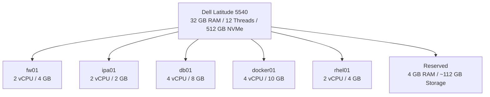

| Resource    | Physical Capacity | VM Allocation |              Reserved |
| ----------- | ----------------: | ------------: | --------------------: |
| CPU Threads |                12 |       14 vCPU | Controlled overcommit |
| RAM         |             32 GB |         28 GB |                  4 GB |
| NVMe        |            512 GB |        400 GB |               ~112 GB |

---

# 16. Design Principles

This resource matrix follows these principles:

### 1. Security First

Resources are allocated to maintain service isolation and prevent unnecessary consolidation.

### 2. Least Privilege

Applications will receive only the database, network and identity access required for their function.

### 3. Centralized Services

Core enterprise functions are centralized:

```text
Identity  → FreeIPA
Database  → PostgreSQL
Secrets   → OpenBao
Access    → Teleport
Proxy     → Nginx
Automation → Ansible / OpenTofu
```

### 4. Application Independence

Centralization does not override official application architecture.

### 5. Resource Awareness

The architecture is designed around a 32 GB RAM / 12-thread physical host and therefore intentionally avoids production-scale resource assumptions.

### 6. Reproducibility

The final configuration is intended to be reproducible using:

```text
OpenTofu
Ansible
Docker Compose
Git
```

### 7. Public Documentation Sanitization

The public repository uses:

```text
corp.example.com
10.10.0.0/16
```

instead of real infrastructure identifiers.

---

# 17. Next Architecture Documents

The VM Resource Matrix establishes the resource foundation for the remaining architecture documents.

The planned sequence is:

```mermaid
flowchart LR

    VM["01<br/>VM Resource Matrix"]
    VLAN["02<br/>VLAN / IP Matrix"]
    PORT["03<br/>Port Matrix"]
    FW["04<br/>Firewall Matrix"]
    FQDN["05<br/>FQDN Matrix"]
    IAM["06<br/>Identity / Account Matrix"]
    DB["07<br/>PostgreSQL Database Matrix"]
    DNS["08<br/>DNS Matrix"]
    DOCKER["09<br/>Docker Network Matrix"]
    SECRET["10<br/>OpenBao Secret Matrix"]
    PKI["11<br/>PKI / Certificate Matrix"]
    INSTALL["12<br/>Installation Order"]

    VM --> VLAN
    VLAN --> PORT
    PORT --> FW
    FW --> FQDN
    FQDN --> IAM
    IAM --> DB
    DB --> DNS
    DNS --> DOCKER
    DOCKER --> SECRET
    SECRET --> PKI
    PKI --> INSTALL
```

---

## Official References

* [OPNsense — Hardware Sizing & Setup](https://docs.opnsense.org/manual/hardware.html)
* [FreeIPA — Quick Start Guide](https://www.freeipa.org/page/Quick_Start_Guide)
* [FreeIPA — Install and Deploy](https://www.freeipa.org/page/InstallAndDeploy.html)
* [PostgreSQL — Resource Consumption](https://www.postgresql.org/docs/current/runtime-config-resource.html)
* [Docker Engine — Installation](https://docs.docker.com/engine/install/)
* [Red Hat Enterprise Linux 10 — System Requirements](https://docs.redhat.com/en/documentation/red_hat_enterprise_linux/10/html/interactively_installing_rhel_over_the_network/system-requirements-and-supported-architectures)

---

> **Document Status:** Draft — Architecture Design Phase
> **Environment:** Public Reference Architecture
> **Documentation Domain:** `corp.example.com`
> **Real Infrastructure:** Not disclosed
