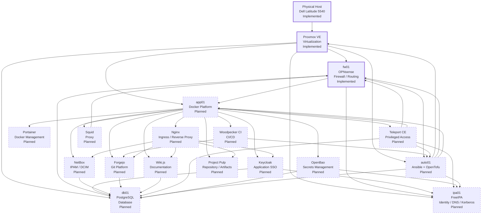
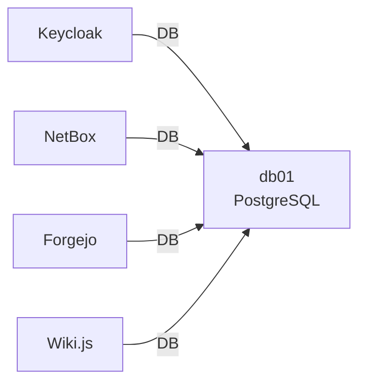
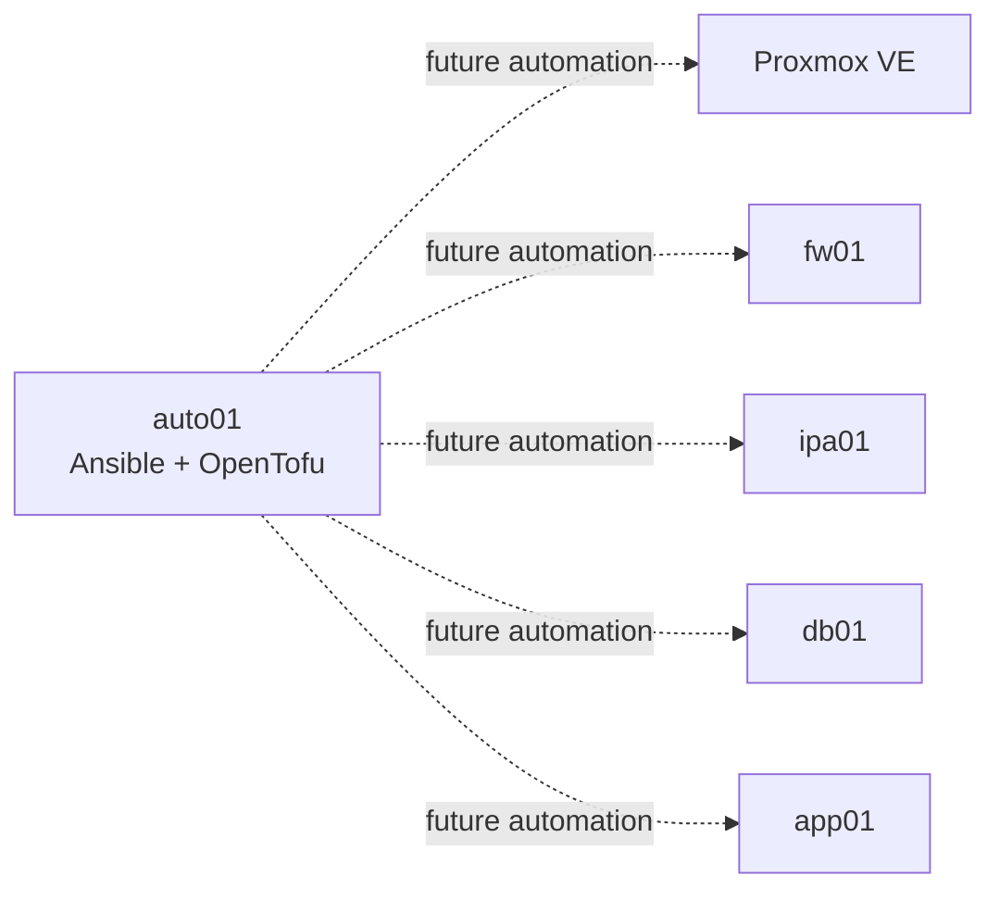

# Dependency Graph

> **Enterprise Reference Architecture — FOSS Home Lab**

## Status

**Reference / Planned Architecture**

This document describes the intended service and infrastructure dependency model. It does **not** imply that every component is currently deployed.

At the current project stage:

- **Implemented:** Proxmox VE and OPNsense / `fw01`
- **Planned:** `ipa01`, `db01`, `app01`, `auto01` and the application services

The graph should therefore be read as a **target dependency model**, with implementation status shown explicitly on the nodes.

---

## 1. Purpose

The Dependency Graph answers:

- Which infrastructure component depends on which other component?
- Which services are infrastructure dependencies?
- Which applications depend on PostgreSQL?
- Which services depend on identity?
- Which components provide access, secrets, automation or ingress?
- What is the expected failure propagation path?

This is complementary to the [Port Map](../network/port-map.md) and [Firewall Rule Set](../network/firewall-rule-set.md).

> **Dependency is not the same as network reachability.** A firewall rule may permit traffic without the destination becoming a functional dependency.

---

## 2. High-Level Dependency Graph



---

## 3. Dependency Layers

The architecture is easier to understand when dependencies are viewed from the bottom upward:

```text
Physical Hardware
        ↓
Proxmox VE
        ↓
Network / Firewall
        ↓
Virtual Machines
        ↓
Core Infrastructure Services
        ↓
Shared Platform Services
        ↓
Application Services
        ↓
Automation / Operations
```

### Layer 1 — Physical / Virtualization

```text
Dell Latitude 5540
        ↓
Proxmox VE
```

All target VMs depend on the physical host and Proxmox VE.

### Layer 2 — Network

```text
Proxmox
   ↓
fw01 / OPNsense
   ↓
VLAN segmentation
   ↓
VM communication
```

The target network separates Management, Identity, Database and Application zones.

### Layer 3 — Core Infrastructure

```text
ipa01
  └── FreeIPA
      ├── Identity
      ├── DNS
      └── Kerberos

db01
  └── PostgreSQL
      └── Application data

app01
  └── Docker platform

auto01
  └── Ansible + OpenTofu
```

---

## 4. Core VM Dependencies

| Component | Depends On | Provides To |
|---|---|---|
| `fw01` | Proxmox | Network routing, segmentation and security enforcement |
| `ipa01` | Proxmox + network + stable DNS/time | Infrastructure identity and authentication |
| `db01` | Proxmox + network + storage | PostgreSQL databases |
| `app01` | Proxmox + network + storage | Containerized application platform |
| `auto01` | Proxmox + network | Infrastructure automation |

---

## 5. Identity Dependency Model

The intended identity chain is:

```text
User
  ↓
Application
  ↓
Keycloak
  ↓
FreeIPA
```

FreeIPA is the planned primary infrastructure identity source.

### Keycloak

Keycloak is intended to provide application-oriented SSO.

```text
Keycloak
   ↓
FreeIPA / LDAP
```

Keycloak additionally depends on PostgreSQL for persistent application data:

```text
Keycloak
   ↓
PostgreSQL
```

Therefore:

```text
Keycloak
   ├──→ FreeIPA
   └──→ PostgreSQL
```

### Teleport CE

Teleport is intended to provide controlled administrative access.

```text
Administrator
      ↓
Teleport
      ↓
Infrastructure / Hosts
```

The target identity model allows Teleport to integrate with the planned identity architecture.

---

## 6. Database Dependency Model

PostgreSQL is the shared stateful dependency for selected applications.



The current architecture identifies the following planned database consumers:

| Application | PostgreSQL Dependency | Status |
|---|---|---|
| Keycloak | Yes | Planned |
| NetBox | Yes | Planned |
| Forgejo | Yes | Planned |
| Wiki.js | Yes | Planned |

Other applications may require PostgreSQL depending on their final deployment model and selected versions.

> Database access should remain application-specific and use dedicated least-privileged database identities.

---

## 7. Application Ingress Dependencies

Nginx is the planned common application ingress point.

```text
Client
  ↓
OPNsense / Firewall
  ↓
Nginx
  ↓
Application
```

Target application routing:

```text
Nginx
 ├──→ Keycloak
 ├──→ NetBox
 ├──→ Forgejo
 ├──→ Wiki.js
 └──→ Other approved HTTPS applications
```

The purpose is to avoid exposing every application directly.

---

## 8. Secrets Dependency

OpenBao is the planned central secrets-management layer.

```text
Application / Service
        ↓
     OpenBao
        ↓
Credentials / Tokens / Secrets
```

Planned consumers include application services, automation, database credentials, service credentials, and certificates or sensitive material where appropriate.

OpenBao itself is hosted on `app01` in the current reference design.

> OpenBao is a **security dependency**, not merely another application container.

---

## 9. Automation Dependency

`auto01` is the future automation control plane.



Planned responsibilities include:

```text
Provision
Configure
Harden
Deploy
Validate
Maintain
```

Automation is deliberately shown as a **future dependency/controller relationship**, because the repository states that the Automation & IaC phase has not yet been reached.

---

## 10. CI/CD Dependency

The planned development flow is:

```text
Developer
   ↓
Forgejo
   ↓
Woodpecker CI
   ↓
Build / Test
   ↓
Deployment
```

Therefore:

```text
Woodpecker
   ├──→ Forgejo
   └──→ auto01 / deployment targets
```

CI runners should receive only the permissions required for their jobs.

They should not obtain unrestricted access to Management, Identity or Database networks.

---

## 11. Documentation Dependency

Wiki.js is the planned operational documentation platform.

```text
Wiki.js
   ↓
PostgreSQL
```

However, critical documentation should not depend exclusively on Wiki.js:

```text
Git Repository
     ↓
Critical Architecture / Runbooks
     ↓
Wiki.js
```

The repository remains the recoverable source for the project's core documentation.

---

## 12. Infrastructure Source-of-Truth Dependency

NetBox is planned as the infrastructure and network source of truth.

```text
NetBox
 ├── IPAM
 ├── DCIM
 ├── Device / VM inventory
 └── Network documentation
```

Future relationship:

```text
Network / Infrastructure
        ↓
      NetBox
        ↓
Automation / Documentation
```

NetBox should not create a parallel unmanaged inventory model.

---

## 13. Proxy / Egress Dependency

Squid is planned as a controlled HTTP/HTTPS proxy.

```text
Application / Clients
        ↓
      Squid
        ↓
     OPNsense
        ↓
       WAN
```

Squid must not become a bypass path around the OPNsense security model.

---

## 14. Failure Propagation

A dependency graph is most useful when considering failures.

### Proxmox failure

```text
Proxmox
   ↓
fw01 + ipa01 + db01 + app01 + auto01
   ↓
All dependent services
```

### `fw01` failure

```text
fw01
   ↓
Inter-VLAN communication
   ↓
Cross-zone service dependencies
```

### FreeIPA failure

Potential impact:

```text
FreeIPA
   ↓
Authentication / Identity-dependent services
   ├── Keycloak integration
   ├── Linux host identity
   └── Administrative identity flows
```

Local break-glass access should remain available for recovery.

### PostgreSQL failure

Potential impact:

```text
PostgreSQL
   ├── Keycloak
   ├── NetBox
   ├── Forgejo
   └── Wiki.js
```

Affected applications may remain running but lose persistent application functionality depending on their architecture.

### `app01` failure

Potential impact:

```text
app01
   ├── Nginx
   ├── Keycloak
   ├── OpenBao
   ├── Teleport
   ├── NetBox
   ├── Forgejo
   ├── Woodpecker
   ├── Wiki.js
   ├── Squid
   └── Project Pulp
```

Because multiple services are intentionally consolidated on `app01`, it is a significant failure domain in the current modest-hardware design.

---

## 15. Dependency Matrix

| Source | Dependency | Relationship | Status |
|---|---|---|---|
| All VMs | Proxmox VE | Virtualization | Implemented |
| All inter-zone traffic | fw01 | Network enforcement | Implemented / target policy |
| Linux identity clients | FreeIPA | Authentication / identity | Planned |
| Keycloak | FreeIPA | External identity source | Planned |
| Keycloak | PostgreSQL | Persistent data | Planned |
| NetBox | PostgreSQL | Persistent data | Planned |
| Forgejo | PostgreSQL | Persistent data | Planned |
| Wiki.js | PostgreSQL | Persistent data | Planned |
| Applications | Nginx | HTTPS ingress | Planned |
| Applications | OpenBao | Secret retrieval | Planned |
| Administrator | Teleport | Privileged access | Planned |
| Woodpecker CI | Forgejo | Source / webhook integration | Planned |
| Woodpecker CI | auto01 | Future deployment automation | Planned |
| Squid | fw01 | Controlled egress | Planned |
| auto01 | Infrastructure | Configuration / provisioning | Planned |

---

## 16. Direct vs Transitive Dependencies

### Direct dependency

A service requires the dependency to perform its normal operation.

Example:

```text
Keycloak → PostgreSQL
```

### Transitive dependency

The service indirectly depends on another component through an intermediate service.

Example:

```text
Application
   ↓
Keycloak
   ↓
FreeIPA
```

The application may therefore have a transitive dependency on FreeIPA when Keycloak authentication is required.

This distinction is important during troubleshooting.

---

## 17. Dependency Classification

| Dependency Type | Examples |
|---|---|
| Compute | Proxmox VE |
| Network | OPNsense / VLANs |
| Identity | FreeIPA |
| Database | PostgreSQL |
| Platform | Docker |
| Ingress | Nginx |
| Secrets | OpenBao |
| Privileged Access | Teleport |
| Inventory | NetBox |
| Source Control | Forgejo |
| CI/CD | Woodpecker |
| Documentation | Wiki.js |
| Proxy / Egress | Squid |
| Repository / Artifacts | Project Pulp |
| Automation | Ansible / OpenTofu |

---

## 18. Dependency Design Principles

1. Keep dependencies explicit.
2. Avoid unnecessary cross-zone communication.
3. Prefer dedicated service identities.
4. Keep database access application-specific.
5. Centralize ingress where practical.
6. Do not bypass OPNsense with alternate egress paths.
7. Treat secrets management as a security dependency.
8. Keep break-glass access independent of centralized identity.
9. Document both direct and transitive dependencies.
10. Revalidate dependencies whenever an application or version changes.
11. Do not treat a planned dependency as implemented.
12. Record implementation evidence separately from the reference graph.

---

## 19. Troubleshooting Order

When a service fails, follow the dependency direction from the bottom upward:

```text
Physical Host
     ↓
Proxmox
     ↓
Network / OPNsense
     ↓
VM
     ↓
Operating System
     ↓
Identity / DNS / NTP
     ↓
Database
     ↓
Container Platform
     ↓
Application Dependency
     ↓
Application
```

This prevents application-level troubleshooting from masking an infrastructure dependency failure.

---

## 20. Implementation Evidence

When a dependency becomes implemented, record:

```text
Source service:
Dependency:
Dependency type:
Host:
Protocol:
Port:
Authentication:
Required for:
Failure behavior:
Validation:
Status:
Known deviations:
```

Do not document a dependency as **Implemented** merely because it exists in the target architecture.

---

## Related Documentation

- [Architecture Overview](overview.md)
- [Identity Architecture](identity.md)
- [Storage Architecture](storage.md)
- [VM Design](../vm-design/vm-design.md)
- [Network Architecture](../network/network.md)
- [Port Map](../network/port-map.md)
- [Firewall Rule Set](../network/firewall-rule-set.md)
- [Resource Sheet](../resource-matrix/resource-sheet.md)
- [VM Resource Matrix](../resource-matrix/vm-resource-matrix.md)
- [Security Architecture](../security/security.md)

---

## Summary

The target dependency model is:

```text
Physical Host
      ↓
Proxmox VE
      ↓
OPNsense / Network
      ↓
VMs
      ↓
+-------------------+-------------------+
|                   |                   |
FreeIPA          PostgreSQL          Docker
|                   |                   |
+---------+---------+---------+---------+
          |                   |
      Identity            Applications
          |                   |
      Keycloak             Nginx
      Teleport             OpenBao
                          NetBox
                          Forgejo
                          Woodpecker
                          Wiki.js
                          Squid
                          Pulp
```

> **The graph represents the target architecture. Implementation status must always be confirmed using laboratory evidence.**
