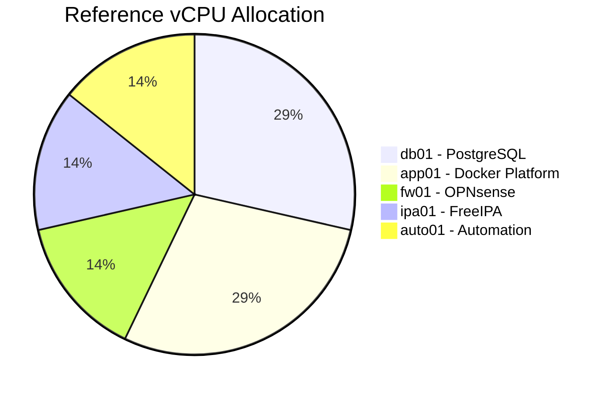
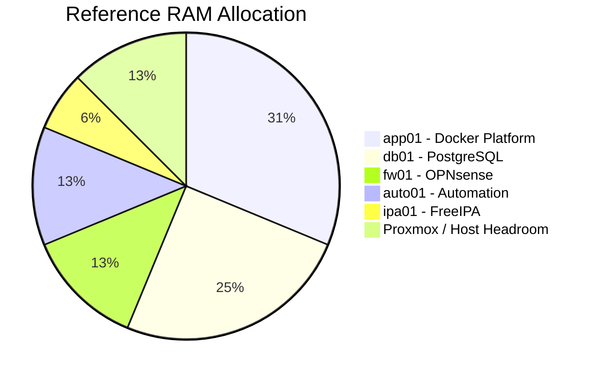
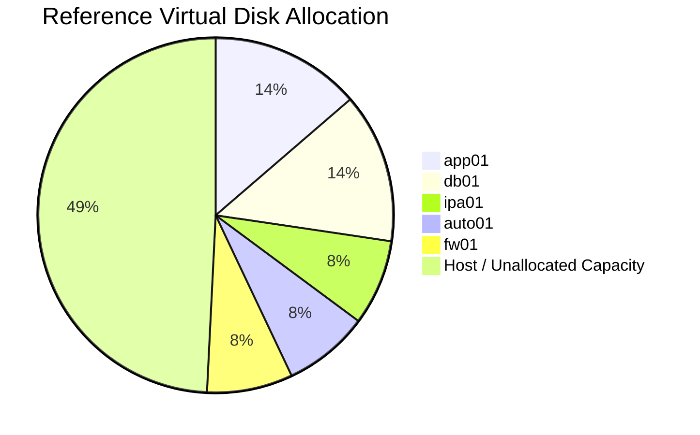
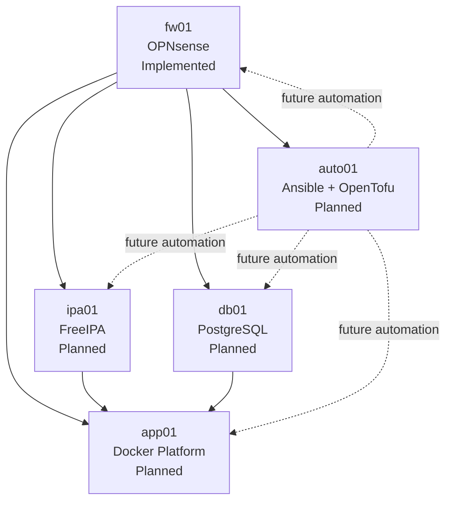

# VM Resource Matrix

> **Enterprise Reference Architecture — FOSS Home Lab**

> [!IMPORTANT]
> **Reference / Planning Document**
>
> This matrix describes the **planned reference architecture and resource sizing**. It is not a live inventory.
>
> Only components explicitly documented as implemented should be considered implemented in the laboratory.
>
> All domain names, IP addresses, hostnames, VM IDs and resource allocations shown here are documentation-only examples.
>
> **Documentation Domain:** `corp.example.com`

---

## 1. Status Model

| Status | Meaning |
|---|---|
| **Implemented** | Installed and tested in the laboratory. |
| **Planned** | Included in the reference architecture but not yet implemented/tested. |
| **Documented** | An architectural/design decision; not an implementation claim. |
| **Future** | Possible later expansion outside the current scope. |

The resource matrix is primarily a **Planned / Documented** reference and must not be interpreted as a current VM inventory.

---

## 2. Physical Host Reference

| Resource | Specification |
|---|---|
| Physical Host | Dell Latitude 5540 |
| CPU | 13th Gen Intel® Core™ i7-1355U |
| Physical Cores | 10 |
| Logical Threads | 12 |
| Memory | 32 GB DDR4-3200 |
| Storage | 512 GB PCIe NVMe Gen4 x4 |
| Hypervisor | Proxmox VE |
| Architecture | x86-64 / AMD64 |

**Implemented:** Proxmox VE is used in the laboratory. The VM allocations below are reference/planned values unless explicitly marked otherwise.

---

## 3. VM Naming Model

The target naming convention is role-based:

```text
fw01
ipa01
db01
app01
auto01
```

Older names such as `docker01` and `rhel01` are deprecated and are not part of the target architecture.

---

## 4. Public Example Network

```text
10.10.0.0/16
```

| VLAN | Network | Purpose |
|---:|---|---|
| 10 | `10.10.10.0/24` | Management |
| 20 | `10.10.20.0/24` | Identity / Core |
| 30 | `10.10.30.0/24` | Database |
| 40 | `10.10.40.0/24` | Application |

Gateway convention:

```text
10.10.<VLAN>.1
```

---

## 5. Reference VM Matrix

| VM ID | Hostname | Role | Operating System | VLAN | Example IP | vCPU | RAM | OS Disk | Data Disk | Total Disk | Status |
|---:|---|---|---|---:|---|---:|---:|---:|---:|---:|---|
| 100 | `fw01` | Firewall / Gateway | OPNsense | — | `10.10.x.1` | 2 | 4 GB | 40 GB | — | 40 GB | **Implemented** |
| 101 | `ipa01` | Identity / DNS | Fedora Server | 20 | `10.10.20.10` | 2 | 2 GB | 20 GB | 20 GB | 40 GB | **Planned** |
| 102 | `db01` | PostgreSQL Database | Pardus Server | 30 | `10.10.30.10` | 4 | 8 GB | 20 GB | 50 GB | 70 GB | **Planned** |
| 103 | `app01` | Docker Application Platform | Ubuntu Server | 40 | `10.10.40.10` | 4 | 10 GB | 20 GB | 50 GB | 70 GB | **Planned** |
| 104 | `auto01` | Automation | RHEL | 10 | `10.10.10.10` | 2 | 4 GB | 20 GB | 20 GB | 40 GB | **Planned** |
| **TOTAL** | | | | | | **14** | **28 GB** | **120 GB** | **140 GB** | **260 GB** | **Reference** |

> VM IDs, IP addresses and resource allocations are planning values, not claims about the current laboratory inventory.

---

## 6. Physical Resource Headroom

Reference allocation:

```text
CPU:     14 vCPU / 12 logical threads ≈ 1.17:1
RAM:     28 GB / 32 GB
Storage: 260 GB / 512 GB
```

The remaining capacity is intentionally reserved for Proxmox overhead, filesystem cache, temporary workload spikes, future adjustments and host operations.

### CPU Allocation



### RAM Allocation



---

## 7. Storage Allocation



The reference VM disks consume 260 GB of the 512 GB physical NVMe. Actual usable capacity depends on the Proxmox storage backend, filesystem overhead and provisioning model.

---

## 8. Linux VM Disk Standard

Linux VMs use a two-disk model.

```text
Disk 1 — OS
└── 20 GiB baseline
    ├── EFI System Partition
    ├── /boot
    └── vg_os
        └── lv_root

Disk 2 — Data
└── 20 GiB baseline
    └── vg_data
        ├── lv_var
        ├── lv_home
        ├── lv_tmp
        └── Role-specific data
```

The second disk owns `/var`, `/home`, and `/tmp`. This separates operating-system files from system, application and persistent workload data.

### Workload-specific sizing

| Workload | OS Disk | Data Disk |
|---|---:|---:|
| General Linux VM | 20 GiB | 20 GiB |
| `ipa01` | 20 GiB | 20 GiB |
| `auto01` | 20 GiB | 20 GiB |
| `db01` | 20 GiB | 50 GiB |
| `app01` | 20 GiB | 50 GiB |

---

## 9. fw01 — OPNsense

**Status: Implemented**

`fw01` is the dedicated firewall/router role. OPNsense is already used as a VM in the laboratory.

Reference allocation:

| Resource | Allocation |
|---|---:|
| vCPU | 2 |
| RAM | 4 GB |
| Storage | 40 GB |

The Linux two-disk standard does not apply to OPNsense.

---

## 10. ipa01 — FreeIPA

**Status: Planned**

`ipa01` is the planned Fedora VM for FreeIPA identity and infrastructure services.

Planned responsibilities include identity management, authentication, authorization, Kerberos, LDAP, host enrollment and identity-related DNS integration.

| Resource | Allocation |
|---|---:|
| vCPU | 2 |
| RAM | 2 GB |
| OS Disk | 20 GB |
| Data Disk | 20 GB |
| VLAN | 20 |
| Example IP | `10.10.20.10` |
| FQDN | `ipa01.corp.example.com` |

These values describe the reference design and are not an implementation claim.

---

## 11. db01 — PostgreSQL

**Status: Planned**

`db01` is the planned Pardus VM for centralized PostgreSQL services.

| Resource | Allocation |
|---|---:|
| vCPU | 4 |
| RAM | 8 GB |
| OS Disk | 20 GB |
| Data Disk | 50 GB |
| VLAN | 30 |
| Example IP | `10.10.30.10` |
| FQDN | `db01.corp.example.com` |

The PostgreSQL data directory is planned for the second disk. Each application should receive its own database and least-privileged database identity where appropriate.

---

## 12. app01 — Docker Application Platform

**Status: Planned**

`app01` is the planned Ubuntu Server VM for the FOSS application platform.

Planned services include:

- Nginx
- Portainer
- Teleport CE
- Keycloak
- OpenBao
- NetBox
- Squid Gateway
- Forgejo
- Woodpecker CI
- Wiki.js
- Project Pulp

These services are **planned**, not currently implemented in the laboratory unless separately documented as implemented.

| Resource | Allocation |
|---|---:|
| vCPU | 4 |
| RAM | 10 GB |
| OS Disk | 20 GB |
| Data Disk | 50 GB |
| VLAN | 40 |
| Example IP | `10.10.40.10` |
| FQDN | `app01.corp.example.com` |

Persistent application data is planned for the second disk.

---

## 13. auto01 — Automation

**Status: Planned**

`auto01` is the planned RHEL automation VM.

Planned tooling includes Ansible, OpenTofu, Git-based infrastructure definitions, configuration management and repeatable provisioning.

Automation has **not yet been implemented in the laboratory**. This VM therefore remains a planned architecture component.

| Resource | Allocation |
|---|---:|
| vCPU | 2 |
| RAM | 4 GB |
| OS Disk | 20 GB |
| Data Disk | 20 GB |
| VLAN | 10 |
| Example IP | `10.10.10.10` |
| FQDN | `auto01.corp.example.com` |

---

## 14. Dependency Model



The dependency diagram describes the intended architecture, not current deployment state.

---

## 15. Resource Allocation Principles

1. Use conservative initial allocations.
2. Keep host headroom available.
3. Increase resources based on observed workload.
4. Avoid unnecessary reservations.
5. Give database and application workloads additional resources when justified.
6. Keep infrastructure services lightweight.
7. Treat the matrix as a tunable reference rather than a fixed production specification.
8. Never document a planned resource as implemented without laboratory evidence.

---

## 16. Future Expansion

Potential future capabilities include additional Proxmox nodes, identity replicas, PostgreSQL replication, application replicas, load balancing, centralized monitoring, high availability and infrastructure automation rollout.

These are **Future** considerations and are outside the current implementation scope.
